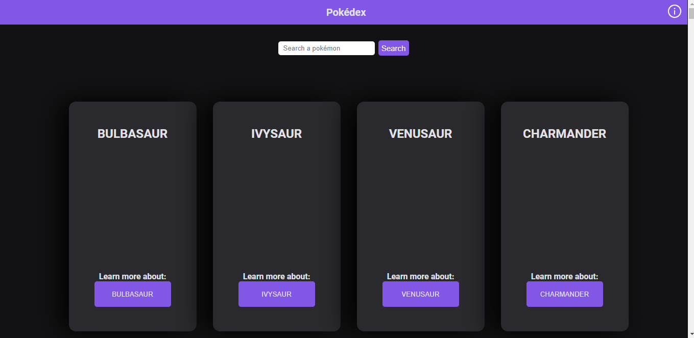

<div align="center">

# Pokédex 🔴

</div>

<p align="center">
  A app written in Next.js to show pokémons
</p>

<div align="center">
  

</div>

<div align="center">

  [](https://github.com/styled-components/styled-components)
  
  

</div>

---

## Techologies used 🛠

- Next.js
- Typescript
- Eslint
- prettier
- styled-components
- framer-motion
- React-icons

## How to run and contribute 🤔

```
# Clone repository

$ git clone https://github.com/r3nanp/pokedex.git
```

```
# Run this command at root of directory

$ yarn or npm run install
```

### How to Fork the project 💪

```
# Create a new branch with your changes:

$ git checkout -b <branch>
```

```
# Save your changes and create a commit message telling you what you did:

$ git commit -m "<commit>"
```

```
# Submit your changes:

$ git push origin <branch>
```

---

### Local settings

```
# To run the app in your machine:

$ yarn dev or npm run dev
```

```
# To build the app:

$ yarn build or npm run build
```
